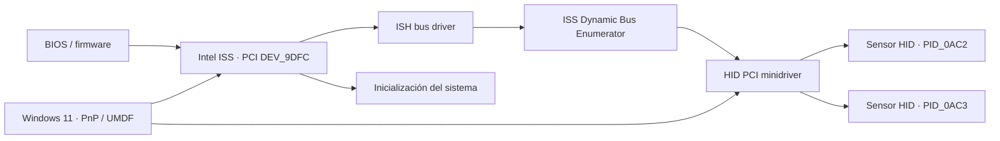
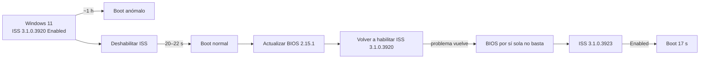
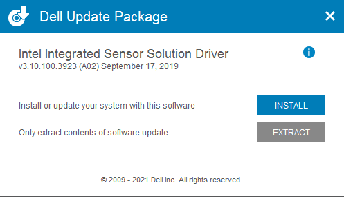
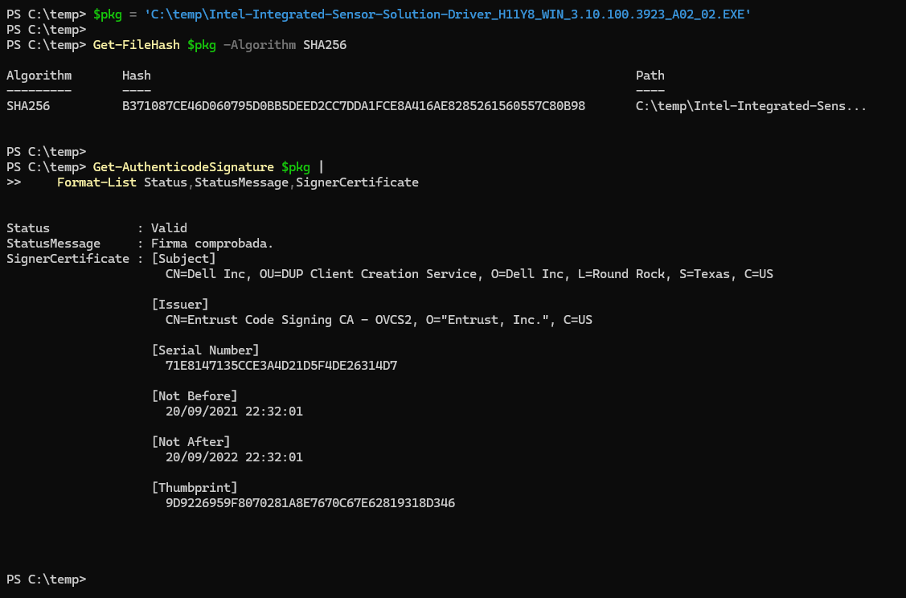
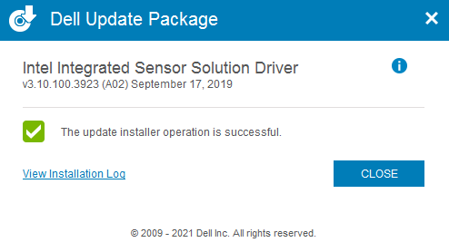
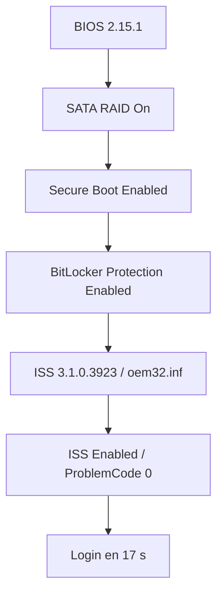
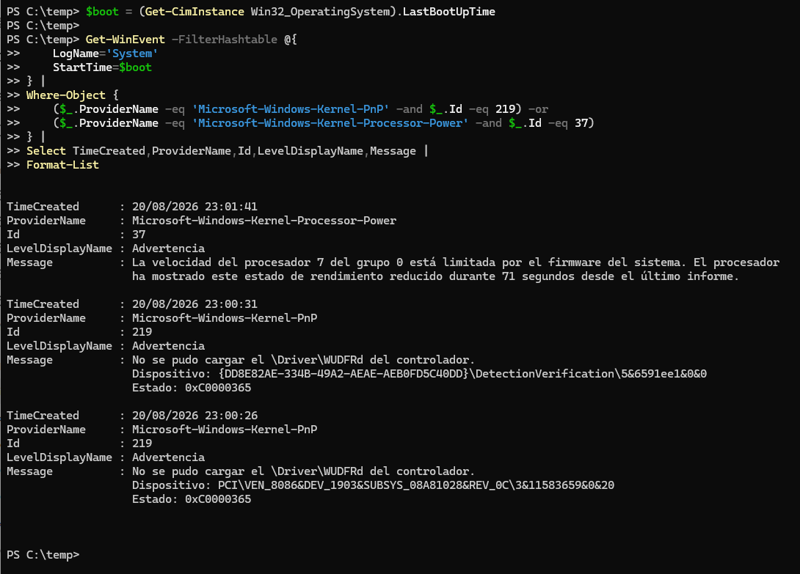
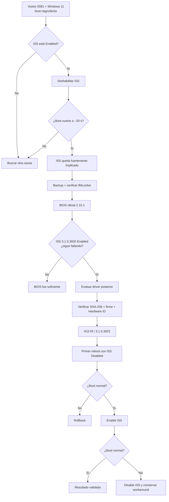

# Dell Vostro 5581 y Windows 11: de una hora a 17 segundos

> [!abstract] Resultado
> En este **Dell Vostro 5581**, el upgrade de Windows 10 a Windows 11 dejó el arranque atrapado durante decenas de minutos —en ocasiones alrededor de una hora— antes de mostrar el login. La prueba A/B aisló el problema en **Intel(R) Integrated Sensor Solution (ISS)** con driver **3.1.0.3920**. La BIOS oficial **2.15.1** de Dell incluía precisamente una corrección para arranques lentos tras migrar a Windows 11, pero **no bastó en esta unidad**. El sistema quedó funcional con BIOS **2.15.1** + ISS **3.1.0.3923**, obtenido del Dell Update Package **H11Y8**. Con ISS habilitado, el arranque final medido fue de **17 s**.

> [!warning] Alcance
> Este documento describe **un caso real y una prueba de campo**, no una certificación de Dell. El paquete H11Y8 soporta Windows 11 y contiene el Hardware ID usado por este equipo, pero Dell **no lista el Vostro 5581 entre los sistemas compatibles con H11Y8**. La decisión de probarlo se tomó únicamente después de verificar firma, SHA-256, payload, Hardware ID, copia de seguridad y capacidad de rollback.

El síntoma era aparatoso, pero la investigación terminó girando alrededor de una
idea bastante sencilla: separar las capas. Primero se comprobó si el tiempo se
iba en el dispositivo ISS; después, si la BIOS corregía por sí sola esa relación;
y por último, si una versión posterior de toda la pila permitía habilitar de
nuevo el hardware sin recuperar el bloqueo.

## Cómo encaja Intel ISS en el arranque

Intel Integrated Sensor Solution no es solo el nombre que aparece en el
Administrador de dispositivos. En este equipo, el dispositivo PCI raíz
`VEN_8086&DEV_9DFC` expone una pila con el bus ISS y sensores HID hijos. Windows
debe enumerar el hardware, cargar sus drivers e integrar los dispositivos antes
de estabilizar la sesión.

El paquete H11Y8 refleja esa composición: incluye **ISS**, **ISS Dynamic Bus
Enumerator** y **HID PCI minidriver**. Esto importa tanto al actualizar como al
volver atrás: sustituir únicamente `ish.inf` no garantiza revertir toda la pila.



El diagrama es un modelo de diagnóstico, no una afirmación de que cada segundo
del arranque dependa linealmente de esos nodos. Su utilidad está en mostrar por
qué una prueba A/B sobre el dispositivo raíz puede cambiar el boot y por qué un
paquete compuesto exige una estrategia de rollback más amplia que un único INF.

## 1. Privacidad de las evidencias

Las capturas publicadas han sido seleccionadas o recortadas para no exponer información sensible. En particular, **no se incluye ninguna clave de recuperación BitLocker**, Service Tag, Express Service Code ni identificadores de cuenta. La fotografía de BIOS se ha recortado para conservar solamente la versión de firmware.


## 2. Entorno del incidente

| Elemento           | Estado observado                                                             |
| ------------------ | ---------------------------------------------------------------------------- |
| Equipo             | Dell Vostro 5581, Reg Model P77F / Reg Type P77F001                          |
| CPU                | Intel Core i5-8265U                                                          |
| RAM                | 8 GB DDR4-2400, single channel                                               |
| Almacenamiento     | NVMe SK hynix BC501 256 GB                                                   |
| Sistema            | Windows 11, procedente de upgrade desde Windows 10                           |
| BIOS inicial       | 2.2.0                                                                        |
| BIOS final         | 2.15.1                                                                       |
| SATA Operation     | RAID On                                                                      |
| Secure Boot        | Enabled                                                                      |
| BitLocker          | C: cifrado, XTS-AES 128; protección suspendida sólo durante el flash de BIOS |
| ISS Hardware ID    | `PCI\VEN_8086&DEV_9DFC&SUBSYS_08A81028&REV_30`                               |
| ISS driver inicial | `ish.inf` / `oem96.inf` / 3.1.0.3920                                         |
| ISS driver final   | `ish.inf` / `oem32.inf` / 3.1.0.3923                                         |

## 3. Síntoma

Antes del cambio de sistema operativo, Windows 10 arrancaba aproximadamente en dos minutos. Tras el upgrade a Windows 11, la máquina podía permanecer durante **~1 hora** antes de llegar a la pantalla de login. Interrumpir ese proceso podía conducir a _Automatic Repair_, pero esa pantalla era un efecto secundario de cortar un arranque anormalmente largo, no la causa raíz.

El comportamiento estaba además documentado por otros propietarios de Vostro 5581: en Dell Community se describen esperas de **1–2 horas** y un workaround consistente en deshabilitar _Intel Integrated Sensor Solution_.[^community-2023] Otro hilo del mismo modelo documenta la pantalla negra con cursor y el mismo dispositivo como desencadenante.[^community-boot]

## 4. Salvaguarda antes de intervenir

Antes de modificar firmware o drivers se realizó una imagen **bare-metal** con Clonezilla y verificación posterior de la imagen. El volumen BitLocker fue copiado cifrado; no fue necesario descifrar la unidad para obtener una copia de recuperación de disco.

Clonezilla se encuentra en su [sitio oficial de descargas](https://clonezilla.org/downloads.php). Esta copia fue el último nivel de rollback, por encima del rollback de drivers y de la propia BIOS.

Para actualizar la BIOS, BitLocker se suspendió expresamente:

```powershell
Suspend-BitLocker -MountPoint "C:" -RebootCount 0
```

Con `-RebootCount 0`, Microsoft documenta que la protección permanece suspendida hasta ejecutar `Resume-BitLocker`; los datos siguen cifrados.[^suspend-bitlocker]

Tras finalizar el firmware:

```powershell
Resume-BitLocker -MountPoint "C:"
manage-bde -status C:
```

## 5. Aislamiento del culpable mediante A/B

La prueba decisiva no fue un log aislado, sino la repetibilidad del tiempo de arranque al modificar **una sola variable**: el estado de Intel ISS.

| Fase                            |   BIOS | ISS          |     Driver ISS | Resultado                             |
| ------------------------------- | -----: | ------------ | -------------: | ------------------------------------- |
| Windows 11, estado problemático |  2.2.0 | Enabled      |     3.1.0.3920 | espera extrema, históricamente ~1 h   |
| Workaround inicial              |  2.2.0 | **Disabled** |     3.1.0.3920 | ~20–21 s                              |
| Tras BIOS 2.15.1                | 2.15.1 | Disabled     |     3.1.0.3920 | ~21 s                                 |
| Prueba de BIOS                  | 2.15.1 | **Enabled**  |     3.1.0.3920 | >60 s sin login; problema reproducido |
| Tras H11Y8, control             | 2.15.1 | Disabled     |     3.1.0.3923 | **22 s**                              |
| Estado final                    | 2.15.1 | **Enabled**  | **3.1.0.3923** | **17 s**                              |



La fuerza de esta evidencia es que el workaround y la corrección final actúan sobre el mismo componente y producen cambios de tiempo grandes y repetibles.

## 6. BIOS 2.15.1: necesaria, pero no suficiente en esta unidad

Dell publica la BIOS **2.15.1** específicamente para Inspiron 5480/5488/5482/5580/5582 y **Vostro 5481/5581**. En el changelog figura literalmente una corrección para el problema por el que el sistema tarda en arrancar después de actualizar a Windows 11.[^bios]

**Página oficial:** [Dell BIOS 2.15.1 / VC007](https://www.dell.com/support/home/en-us/drivers/driversdetails?driverid=vc007)

**Descarga directa oficial:** [Inspiron_5480_5488_5580_5482_5582_Vostro_5481_5581_2.15.1.exe](https://dl.dell.com/FOLDER08728391M/1/Inspiron_5480_5488_5580_5482_5582_Vostro_5481_5581_2.15.1.exe)

SHA-256 publicado por Dell y verificado localmente:

```text
6b48df999ce7308a965f62a09128351ccb172d1e8637fae1aef2f97b290b170d
```

El intento de flash desde `F12 -> BIOS Flash Update` falló inmediatamente al 0 %. El mismo ejecutable, lanzado desde Windows, completó correctamente el proceso mediante BIOS Guard. Después se verificaron BIOS 2.15.1, `RAID On`, Secure Boot y reactivación de BitLocker.

Sin embargo, al reactivar ISS con el driver 3.1.0.3920 el boot volvió a degradarse. Por tanto, **en esta unidad la BIOS 2.15.1 no resolvió por sí sola la incidencia**.

## 7. Driver original: 3.1.0.3920

El dispositivo raíz era:

```text
Intel(R) Integrated Sensor Solution
PCI\VEN_8086&DEV_9DFC&SUBSYS_08A81028&REV_30
Service: ISH
INF: oem96.inf / ish.inf
Driver: 3.1.0.3920
```

Los sensores hijos observados pertenecían a la pila HID de Intel:

```text
HID\VID_8087&PID_0AC2
HID\VID_8087&PID_0AC3
```

El driver original se exportó antes de probar otra versión:

```powershell
pnputil /export-driver oem96.inf C:\temp\ISS-backup
```

PnPUtil está incluido en Windows y Microsoft documenta oficialmente `enum-devices`, `export-driver`, `disable-device` y `enable-device`.[^pnputil]

## 8. Por qué se descartó 65YNT

Dell ofrece para Vostro 5581 el paquete **65YNT**, versión exterior `3.10.100.3723`.[^65ynt] El problema es que, al extraerlo y leer `MUP.xml`, el `Image type="DRVR"` era **3.1.0.3723**.

```text
Driver instalado:       3.1.0.3920
Payload real 65YNT:     3.1.0.3723
Resultado:               downgrade
```

El número de versión del instalador no debe confundirse con la versión efectiva del driver que terminará en DriverStore.

## 9. H11Y8: candidato no certificado para el modelo, pero técnicamente verificable

El paquete seleccionado fue:

```text
Intel-Integrated-Sensor-Solution-Driver_H11Y8_WIN_3.10.100.3923_A02_02.EXE
```

**Página oficial:** [Dell H11Y8 — Intel Integrated Sensor Solution Driver](https://www.dell.com/support/home/en-us/drivers/driversdetails?driverid=h11y8)

**Descarga directa oficial:** [H11Y8 3.10.100.3923 A02](https://dl.dell.com/FOLDER05826820M/3/Intel-Integrated-Sensor-Solution-Driver_H11Y8_WIN_3.10.100.3923_A02_02.EXE)

Dell publica para H11Y8:[^h11y8]

- versión del paquete `3.10.100.3923, A02`;
- soporte de Windows 11;
- instalación de ISS, ISS Dynamic Bus Enumerator y HID PCI minidriver;
- SHA-256 `b371087ce46d060795d0bb5deed2cc7dda1fce8a416ae8285261560557c80b98`.

Pero la misma página lista como sistemas compatibles únicamente Latitude 3310 2-in-1, Latitude 7220 Rugged Extreme Tablet y Latitude 7220EX Rugged Extreme Tablet. **Vostro 5581 no aparece.**



### 9.1. Verificación del payload

La extracción del paquete mostró en `MUP.xml`:

```xml
<version>3.10.100.3923</version>
...
<PCIInfo vendorID="8086" deviceID="9DFC" />
<PCIInfo vendorID="8086" deviceID="A37C" />
<Image type="DRVR" version="3.1.0.3923">
```

También aparecían los tres componentes relevantes en x64 con versión 3.1.0.3923:

```text
ISH_BusDriver
ISH / ISH.sys
HID_PCI / HID_PCI.sys
```

Es decir, aunque Dell no certifica el paquete para este modelo, **el propio payload contiene `VEN_8086&DEV_9DFC` y una versión 3923 posterior a 3920**.

### 9.2. Hash y firma

El ejecutable exterior fue comprobado antes de instalar:

```powershell
$pkg = 'C:\temp\Intel-Integrated-Sensor-Solution-Driver_H11Y8_WIN_3.10.100.3923_A02_02.EXE'
Get-FileHash $pkg -Algorithm SHA256
Get-AuthenticodeSignature $pkg | Format-List Status,StatusMessage,SignerCertificate
```

Resultado:

```text
SHA256 = B371087CE46D060795D0BB5DEED2CC7DDA1FCE8A416AE8285261560557C80B98
Authenticode Status = Valid
Signer = Dell Inc.
```



El `SetupISS.exe` interno llevaba un certificado Intel ya fuera de su periodo de validez al comprobarlo en 2026. Por ese motivo **no se usó el ejecutable interno como ancla de confianza**: se instaló desde el Dell Update Package exterior, cuya firma era válida y cuyo hash coincidía exactamente con el publicado por Dell.

## 10. Instalación y transición de estado

El Dell Update Package completó la instalación correctamente:



Inmediatamente después:

```text
Estado: Iniciado
INF activo: oem32.inf
Driver: 05/14/2019 3.1.0.3923
ConfigFlags: 0
ProblemCode: 0
IsRebootRequired: False
```

El instalador había reactivado ISS, de modo que se volvió a deshabilitar antes del primer reboot controlado:

```powershell
$iss = 'PCI\VEN_8086&DEV_9DFC&SUBSYS_08A81028&REV_30\3&11583659&0&98'
pnputil /disable-device "$iss"
```

Con `3.1.0.3923 + ISS Disabled`, el boot fue **22 s**. Después:

```powershell
pnputil /enable-device "$iss"
```

Antes de reiniciar:

```text
Estado: Iniciado
ConfigFlags: 0
ProblemCode: 0
IsRebootRequired: False
DriverVersion: 3.1.0.3923
```

El siguiente arranque, con ISS **habilitado**, tardó **17 s**.

## 11. Estado final del sistema



| Componente      | Estado final       |
| --------------- | ------------------ |
| BIOS            | 2.15.1             |
| SATA            | RAID On            |
| Secure Boot     | Enabled            |
| BitLocker       | Protection enabled |
| Intel ISS       | Enabled            |
| ISS INF         | oem32.inf          |
| ISS driver      | 3.1.0.3923         |
| ISS ProblemCode | 0                  |
| Boot observado  | 17 s               |

El viejo `oem96.inf` / 3.1.0.3920 permaneció en DriverStore como driver superado y no se eliminó.

## 12. Control final del Event Log

Se revisaron los eventos del último arranque con:

```powershell
$boot = (Get-CimInstance Win32_OperatingSystem).LastBootUpTime

Get-WinEvent -FilterHashtable @{
    LogName='System'
    StartTime=$boot
} |
Where-Object {
    ($_.ProviderName -eq 'Microsoft-Windows-Kernel-PnP' -and $_.Id -eq 219) -or
    ($_.ProviderName -eq 'Microsoft-Windows-Kernel-Processor-Power' -and $_.Id -eq 37)
} |
Select TimeCreated,ProviderName,Id,LevelDisplayName,Message |
Format-List
```



### Resultado observado

Se conservaron tres advertencias:

1. **Kernel-PnP 219 / WUDFRd**, dispositivo `DetectionVerification`, estado `0xC0000365`.
2. **Kernel-PnP 219 / WUDFRd**, dispositivo `PCI\VEN_8086&DEV_1903...`, estado `0xC0000365`.
3. **Kernel-Processor-Power 37**, procesador lógico 7 del grupo 0 limitado por firmware; el mensaje reportó 71 s de estado de rendimiento reducido desde el último informe.

La observación importante para este incidente es lo que **no apareció** en el filtro del último boot:

```text
NO 219 para PCI\VEN_8086&DEV_9DFC   (ISS raíz)
NO 219 para HID\VID_8087&PID_0AC2  (sensores hijos)
NO 219 para HID\VID_8087&PID_0AC3  (sensores hijos)
```

Microsoft documenta que un Kernel-PnP 219 de `WUDFRd` puede aparecer durante la inicialización de dispositivos UMDF cuando el framework todavía no está listo; Windows vuelve a intentar el arranque del dispositivo y, si el evento no se repite continuamente y el dispositivo termina funcionando, puede ser transitorio.[^event219] Por tanto, los dos 219 restantes se **documentan**, pero no constituyen por sí solos evidencia de que el fallo ISS haya vuelto.

El `DEV_1903` corresponde en esta máquina al Intel Dynamic Platform and Thermal Framework Processor Participant previamente verificado. El Event ID 37 queda también documentado como **hallazgo secundario de gestión térmica/energética**. Dado que el login llegó en 17 s y el A/B de ISS quedó resuelto, no hay evidencia de que ese 37 sea el causante del incidente original.

## 13. Causa raíz: formulación prudente

La conclusión de campo más ajustada es:

> En este Vostro 5581, **Windows 11 + Intel Integrated Sensor Solution 3.1.0.3920 habilitado** provocaba un bloqueo o espera extrema durante el arranque. Deshabilitar ISS eliminaba el síntoma y actualizar la pila ISS a **3.1.0.3923** permitió volver a habilitarla manteniendo un boot normal.

No se afirma que `3.1.0.3920` sea defectuoso en todos los Vostro 5581 ni que H11Y8 sea una solución oficialmente soportada por Dell para el modelo. El resultado está respaldado por un **A/B local fuerte** y por reportes comunitarios coincidentes, pero sigue siendo una solución de campo fuera de la matriz de compatibilidad publicada de H11Y8.

## 14. Árbol de decisión reproducible



## 15. Comandos de auditoría rápida

### BIOS

```powershell
Get-CimInstance Win32_BIOS | Select-Object SMBIOSBIOSVersion,ReleaseDate
```

### BitLocker

```powershell
Get-BitLockerVolume -MountPoint C:
manage-bde -status C:
```

### ISS

```powershell
$iss = 'PCI\VEN_8086&DEV_9DFC&SUBSYS_08A81028&REV_30\3&11583659&0&98'
pnputil /enum-devices /instanceid "$iss" /drivers /properties
```

### Propiedades críticas

```powershell
Get-PnpDeviceProperty -InstanceId $iss |
Where-Object {
    $_.KeyName -in @(
        'DEVPKEY_Device_ConfigFlags',
        'DEVPKEY_Device_ProblemCode',
        'DEVPKEY_Device_IsRebootRequired',
        'DEVPKEY_Device_DriverVersion',
        'DEVPKEY_Device_DriverInfPath'
    )
} | Format-Table KeyName,Data -Auto
```

Estado final esperado:

```text
ConfigFlags       0
ProblemCode       0
IsRebootRequired  False
DriverVersion     3.1.0.3923
DriverInfPath     oem32.inf
```

## 16. Rollback

El rollback **probado** es funcional, no un rollback completo del paquete:

```powershell
pnputil /disable-device "$iss"
```

Con ISS deshabilitado, este equipo arrancaba en ~20–22 s tanto con 3920 como con 3923.

No se recomienda publicar un supuesto rollback completo basado únicamente en reinstalar `oem96.inf`: H11Y8 instala **ISS, Dynamic Bus Enumerator y HID PCI minidriver**, por lo que una restauración total puede abarcar más de un INF. Para rollback integral se conservaron:

- el driver anterior en DriverStore;
- la exportación `C:\temp\ISS-backup`;
- la imagen bare-metal verificada de Clonezilla.

## 17. Descargas y fuentes

### Dell

- [BIOS 2.15.1 para Inspiron 5480/5488/5580/5482/5582 y Vostro 5481/5581 — VC007](https://www.dell.com/support/home/en-us/drivers/driversdetails?driverid=vc007)
- [Descarga directa BIOS 2.15.1](https://dl.dell.com/FOLDER08728391M/1/Inspiron_5480_5488_5580_5482_5582_Vostro_5481_5581_2.15.1.exe)
- [Intel Integrated Sensor Solution Driver 3.10.100.3923 A02 — H11Y8](https://www.dell.com/support/home/en-us/drivers/driversdetails?driverid=h11y8)
- [Descarga directa H11Y8](https://dl.dell.com/FOLDER05826820M/3/Intel-Integrated-Sensor-Solution-Driver_H11Y8_WIN_3.10.100.3923_A02_02.EXE)
- [Intel Integrated Sensor Hub Driver 3.10.100.3723 — 65YNT](https://www.dell.com/support/home/en-us/drivers/driversdetails?driverid=65ynt)
- [Dell Community: Vostro 5581, Windows 11 y arranque de 1–2 horas](https://www.dell.com/community/en/conversations/vostro/w11-on-vostro-5581-25gfk-black-screen-with-mouse-cursor-2023-edition/64f9cc2a0571bd0cd6406ed6)
- [Dell Community: Vostro 5581 no arranca correctamente tras Windows 11](https://www.dell.com/community/en/conversations/vostro/dell-vostro-5581-will-not-boot-after-upgrading-to-windows-11/64c105fff4ccf8a8decfbbcf)

### Microsoft

- [PnPUtil command syntax](https://learn.microsoft.com/en-us/windows-hardware/drivers/devtest/pnputil-command-syntax)
- [Event ID 219 / WUDFRd](https://learn.microsoft.com/en-us/troubleshoot/windows-client/setup-upgrade-and-drivers/event-id-219-when-device-plugged-in-windows-system)
- [Suspend-BitLocker](https://learn.microsoft.com/en-us/powershell/module/bitlocker/suspend-bitlocker)
- [Resume-BitLocker](https://learn.microsoft.com/en-us/powershell/module/bitlocker/resume-bitlocker)
- [BitLocker operations guide](https://learn.microsoft.com/en-us/windows/security/operating-system-security/data-protection/bitlocker/operations-guide)

### Backup

- [Clonezilla — descargas oficiales](https://clonezilla.org/downloads.php)

## 18. Notas de evidencia

[^bios]: Dell publica BIOS 2.15.1 para Vostro 5581 y su changelog indica una corrección de arranque lento después de actualizar a Windows 11. Página consultada en agosto de 2026.

[^h11y8]: La página de H11Y8 publica versión 3.10.100.3923 A02, SHA-256, soporte de Windows 11 y tres componentes ISS; no lista Vostro 5581 entre los sistemas compatibles.

[^65ynt]: 65YNT sí lista Vostro 5581, pero Dell lo publica para Windows 10. El payload 3.1.0.3723 fue comprobado localmente leyendo `MUP.xml`.

[^community-2023]: Reporte comunitario de Vostro 5581 con espera de 1–2 h y workaround de deshabilitar ISS.

[^community-boot]: Otro hilo del mismo modelo describe pantalla negra con cursor tras el upgrade a Windows 11 y el mismo workaround.

[^pnputil]: Microsoft Learn, sintaxis oficial de PnPUtil y soporte de `/enum-devices`, `/export-driver`, `/disable-device` y `/enable-device`.

[^suspend-bitlocker]: Microsoft Learn documenta `Suspend-BitLocker -RebootCount 0` para mantener suspendida la protección hasta reanudarla manualmente.

[^event219]: Microsoft documenta que Kernel-PnP 219/WUDFRd puede ser transitorio durante el inicio de UMDF y que, si el driver se carga posteriormente y el evento no es continuo, no requiere acción.

---

**Estado del caso a 2026-08-20:** resuelto en prueba de campo; BIOS 2.15.1, ISS 3.1.0.3923 habilitado, login medido en 17 s. Se recomienda conservar el driver anterior y la imagen bare-metal durante un periodo de observación.

## Relacionado

- [[cuaderno/Windows 11 25H2 - Bloqueo CBS durante KB5121003|Windows 11, servicing y reparación in-place]]
