# Write-Up técnico: recuperación de Arch Linux en WSL ante `Wsl/Service/E_UNEXPECTED`

> [!abstract]
> Una distribución Arch Linux registrada en WSL2 no iniciaba y devolvía `Wsl/Service/E_UNEXPECTED`. Otra distribución WSL sí arrancaba. El análisis mediante `wsl --system`, montaje del VHDX y `chroot` reveló bibliotecas ELF críticas y metadatos de `/var/lib/pacman/local` truncados a cero bytes. La recuperación se realizó restaurando OpenSSL desde caché, usando `pacman-static`, reconstruyendo la base local y reinstalando paquetes afectados.

## Flujo técnico de diagnóstico y recuperación

```mermaid
flowchart TD
    A["wsl -d Arch<br/>E_UNEXPECTED"] --> B["wsl -l -v<br/>Arch registrada"]
    B --> C{"¿Otra distribución inicia?"}

    C -- "No" --> C1["Capa host<br/>WSL / Hyper-V / servicios"]
    C -- "Sí" --> D["Fallo aislado a Arch"]

    D --> E["wsl -d Arch -u root<br/>bash --noprofile --norc"]
    E --> F{"¿Se ejecuta el proceso?"}
    F -- "Sí" --> F1["Usuario, shell o perfiles"]
    F -- "No" --> G["wsl --system -d Arch"]

    G --> H["Localizar y respaldar ext4.vhdx"]
    H --> I["wsl --mount --vhd --bare"]
    I --> J["e2fsck -f -v /dev/sdX"]
    J --> K["chroot /mnt/wslg/distro"]

    K --> L["systemd --version<br/>pacman --version"]
    L --> M{"¿file too short?"}
    M -- "No" --> M1["Revisar logs y configuración"]
    M -- "Sí" --> N["Identificar biblioteca truncada"]

    N --> O["libcrypto.so.3 / libssl.so.3<br/>0 bytes"]
    O --> P["Extraer openssl desde<br/>/var/cache/pacman/pkg"]
    P --> Q["Pacman revela libacl.so.1<br/>también truncada"]
    Q --> R["pacman-static + paquete acl local"]
    R --> S["Pacman y systemd vuelven a cargar"]

    S --> T["Arrancar Arch como root"]
    T --> U["Auditar /var/lib/pacman/local"]
    U --> V{"¿desc vacío o ausente?"}
    V -- "Sí" --> W["Apartar entrada dañada<br/>y reinstalar paquete"]
    V -- "No" --> X["Validar con pacman -Qkk"]

    W --> Y["Reparar bash, ansible,<br/>ansible-core y resto"]
    X --> Y
    Y --> Z["pacman -Syu"]

    Z --> AA["Buscar ejecutables vacíos<br/>y bibliotecas .so a 0 bytes"]
    AA --> AB{"¿Archivo legítimo o crítico?"}
    AB -- "Marcador/test/metapaquete" --> AC["Conservar"]
    AB -- "Ejecutable o .so huérfano" --> AD["Reinstalar paquete o eliminar resto"]
    AC --> AE["Validación final"]
    AD --> AE

    AE --> AF["pacman -Qkk<br/>wsl --shutdown<br/>wsl -d Arch"]
    AF --> AG["Sistema recuperado"]

    classDef decision fill:#fef3c7,stroke:#d97706,color:#78350f;
    classDef diagnostic fill:#f4f4f5,stroke:#71717a,color:#18181b;
    classDef repair fill:#e0f2fe,stroke:#0284c7,color:#0c4a6e;
    classDef success fill:#dcfce7,stroke:#16a34a,color:#14532d;

    class C,F,M,V,AB decision;
    class A,B,D,E,G,H,I,J,K,L,N,O,Q,T,U,AA diagnostic;
    class P,R,S,W,X,Y,Z,AC,AD,AE,AF repair;
    class AG success;
```



## 1. Alcance

Este documento describe la recuperación concreta de una distribución Arch Linux sobre WSL2 con las siguientes propiedades:

```console
WSL:              2.7.11.0
Kernel:           6.18.33.2-2
WSLg:             1.0.73.2
Windows:          10.0.26200.8875
Distribución:     Arch
Otra distribución: docker-desktop
systemd en Arch:  habilitado
```

VHDX:

```console
C:\Applications\Scoop\persist\archwsl\data\ext4.vhdx
```

Tamaño físico observado:

```console
96,63 GiB
```

Capacidad virtual observada:

```console
1 TiB
```

## 2. Síntoma inicial

```powershell
wsl -d Arch
```

```console
Error catastrófico
Código de error: Wsl/Service/E_UNEXPECTED
```

También fallaba:

```powershell
wsl -d Arch -u root --exec /usr/bin/bash --noprofile --norc
```

Por tanto, el fallo no dependía de:

- Usuario predeterminado.
- Zsh.
- `.bashrc`.
- `.zshrc`.
- Perfil interactivo.
- Lanzador `Arch.exe`.

## 3. Hipótesis iniciales

| Hipótesis                    | Prueba                                     | Resultado               |
| ---------------------------- | ------------------------------------------ | ----------------------- |
| WSL roto globalmente         | Arrancar `docker-desktop`                  | Descartada              |
| Servicio WSL bloqueado       | Reiniciar `WslService`, `vmcompute`, `hns` | Sin efecto              |
| Nuevo `Arch.exe` defectuoso  | Usar `wsl -d Arch` directamente            | No era la causa         |
| Usuario o shell dañados      | Forzar `root` y Bash sin perfiles          | Descartada              |
| VHDX ausente                 | Inspeccionar registro y ruta               | Descartada              |
| ext4 gravemente corrupto     | `e2fsck`                                   | Sin bloques defectuosos |
| PID 1 o dependencia ELF rota | `chroot` y ejecutar systemd                | Confirmada              |

## 4. Confirmar que WSL funciona

```powershell
wsl --shutdown
wsl --version
wsl --status
wsl -l -v
```

Prueba de control:

```powershell
wsl -d docker-desktop -u root --exec /bin/sh -c "echo WSL_VM_OK"
```

Resultado:

```console
WSL_VM_OK
```

### Interpretación

Si otra distribución arranca, la infraestructura WSL2 está operativa. El análisis debe desplazarse a:

- Registro específico de la distribución.
- VHDX.
- Sistema de archivos.
- PID 1.
- Dependencias dinámicas.
- Base de paquetes.

## 5. Localizar y respaldar el VHDX

Consulta del registro:

```powershell
$archKey = Get-ChildItem `
  'HKCU:\Software\Microsoft\Windows\CurrentVersion\Lxss' |
Where-Object {
  $_.GetValue('DistributionName') -eq 'Arch'
}

$base = [Environment]::ExpandEnvironmentVariables(
  $archKey.GetValue('BasePath')
)

$vhd = Join-Path $base 'ext4.vhdx'

Get-Item -LiteralPath $vhd |
  Select-Object FullName,
    @{N='GiB';E={[math]::Round($_.Length / 1GB, 2)}},
    LastWriteTime
```

Antes de cualquier reparación:

```powershell
wsl --shutdown

Copy-Item `
  -LiteralPath $vhd `
  -Destination 'D:\WSL-Backups\Arch-ext4-20260805.vhdx'
```

> [!danger]
> No ejecutar `wsl --unregister Arch`. Esa operación elimina la distribución registrada y sus datos.

## 6. Inspección mediante `wsl --system`

```powershell
wsl --system -d Arch -u root -- sh -lc '
df -h /mnt/wslg/distro
mount | grep /mnt/wslg/distro

ls -l /mnt/wslg/distro/bin/sh
ls -l /mnt/wslg/distro/usr/bin/bash
ls -l /mnt/wslg/distro/usr/lib/systemd/systemd
ls -l /mnt/wslg/distro/usr/lib/ld-linux-x86-64.so.2

cat /mnt/wslg/distro/etc/wsl.conf
'
```

Configuración encontrada:

```ini
[boot]
systemd=true

[network]
generateResolvConf=false
```

## 7. Comprobación de ext4

Adjuntar el VHDX:

```powershell
$vhd = 'C:\Applications\Scoop\persist\archwsl\data\ext4.vhdx'

wsl --shutdown
wsl --mount "$vhd" --vhd --bare
```

Identificar el dispositivo desde otra distribución:

```powershell
wsl -d docker-desktop -u root -- \
  lsblk -o NAME,PATH,SIZE,FSTYPE,RO,MOUNTPOINTS
```

Resultado relevante:

```console
sdc  /dev/sdc  1T  ext4  0
```

Reparación:

```powershell
wsl -d docker-desktop -u root -- e2fsck -f -v /dev/sdc
```

Resultado:

```console
FILE SYSTEM WAS MODIFIED
0 bad blocks
```

Después:

```powershell
wsl --unmount
wsl --shutdown
```

Arch continuaba sin arrancar. `e2fsck` no era la solución principal.

## 8. Obtener el error Linux real mediante `chroot`

```powershell
wsl --system -d Arch -u root -- \
  chroot /mnt/wslg/distro /bin/bash --noprofile --norc -lc '
echo CHROOT_OK
/usr/lib/systemd/systemd --version
pacman --version
'
```

Resultado:

```console
CHROOT_OK
/usr/lib/systemd/systemd: error while loading shared libraries:
/usr/lib/libcrypto.so.3: file too short

pacman: error while loading shared libraries:
/usr/lib/libcrypto.so.3: file too short
```

Comprobación:

```console
/usr/lib/libcrypto.so.3 — 0 bytes
/usr/lib/libssl.so.3    — 0 bytes
```

### Diagnóstico

`systemd` no podía cargar OpenSSL. Al no poder ejecutar el PID 1 configurado, WSL devolvía el error genérico `E_UNEXPECTED`.

## 9. Restaurar OpenSSL desde la caché de Pacman

Paquetes encontrados:

```console
openssl-3.6.1-1-x86_64.pkg.tar.zst
openssl-3.6.2-2-x86_64.pkg.tar.zst
openssl-3.6.3-1-x86_64.pkg.tar.zst
```

Como `docker-desktop` no incluía `bsdtar`, `zstd` ni `unzstd`, se copió el paquete a Windows:

```powershell
@'
set -eu

ROOT=/mnt/arch-repair
DEVICE=/dev/sdc
DEST=/mnt/host/c/Temp/arch-openssl-repair

mkdir -p "$ROOT" "$DEST"
mount -t ext4 -o rw "$DEVICE" "$ROOT"

PKG="$(ls -1t \
  "$ROOT"/var/cache/pacman/pkg/openssl-*-x86_64.pkg.tar.zst |
  head -n 1)"

cp "$PKG" "$DEST/openssl.pkg.tar.zst"

sync
umount "$ROOT"
'@ | wsl -d docker-desktop -u root -- sh -s
```

Extracción en Windows:

```powershell
$repair = 'C:\Temp\arch-openssl-repair'
$pkg = "$repair\openssl.pkg.tar.zst"
$extract = "$repair\extract"

New-Item -ItemType Directory -Path $extract -Force | Out-Null

tar.exe -xpf $pkg `
  -C $extract `
  usr/lib/libcrypto.so.3 `
  usr/lib/libssl.so.3
```

Restauración en el VHDX:

```powershell
@'
set -eu

ROOT=/mnt/arch-repair
DEVICE=/dev/sdc
SRC=/mnt/host/c/Temp/arch-openssl-repair/extract/usr/lib

mkdir -p "$ROOT"
mount -t ext4 -o rw "$DEVICE" "$ROOT"

cp -f "$SRC/libcrypto.so.3" "$ROOT/usr/lib/libcrypto.so.3"
cp -f "$SRC/libssl.so.3"    "$ROOT/usr/lib/libssl.so.3"

chown 0:0 \
  "$ROOT/usr/lib/libcrypto.so.3" \
  "$ROOT/usr/lib/libssl.so.3"

chmod 755 \
  "$ROOT/usr/lib/libcrypto.so.3" \
  "$ROOT/usr/lib/libssl.so.3"

sync

stat -c '%n — %s bytes' \
  "$ROOT/usr/lib/libcrypto.so.3" \
  "$ROOT/usr/lib/libssl.so.3"

od -An -tx1 -N4 "$ROOT/usr/lib/libcrypto.so.3"

umount "$ROOT"
'@ | wsl -d docker-desktop -u root -- sh -s
```

Resultado:

```console
libcrypto.so.3 — 5922312 bytes
libssl.so.3    — 1011672 bytes
7f 45 4c 46
```

`7f 45 4c 46` es la cabecera ELF.

## 10. Segundo fallo: `libacl.so.1`

Después de recuperar OpenSSL:

```console
/usr/bin/pacman: error while loading shared libraries:
/usr/lib/libacl.so.1: file too short
```

Se descubrió que `libacl.so.1` también estaba truncada.

## 11. Recuperación con `pacman-static`

Se copió un binario estático a:

```console
C:\Temp\arch-repair\pacman-static
```

Problemas iniciales:

```console
GPGME error: Invalid crypto engine
failed to synchronize all databases
unable to lock database
```

### Configuración temporal

Se usó exclusivamente para paquetes locales ya descargados:

```ini
[options]
Architecture = x86_64
DBPath = /var/lib/pacman/
CacheDir = /var/cache/pacman/pkg/
LogFile = /var/log/pacman.log
SigLevel = Never
LocalFileSigLevel = Never
RemoteFileSigLevel = Never
```

> [!warning]
> Esta configuración no debe utilizarse para una actualización general desde repositorios. Se empleó solo para recuperar paquetes ya presentes en la caché y romper la dependencia circular.

El bloqueo se eliminó:

```bash
rm -f /var/lib/pacman/db.lck
```

Se reinstaló `acl` desde la caché:

```bash
pacman-static \
  --config /tmp/pacman-recovery.conf \
  -U \
  --noconfirm \
  --noscriptlet \
  --overwrite '*' \
  /var/cache/pacman/pkg/acl-2.4.0-1-x86_64.pkg.tar.zst
```

Resultado:

```console
Pacman v7.1.0
systemd 260
```

Arch volvió a iniciar:

```powershell
wsl -d Arch -u root --exec /bin/bash --noprofile --norc
```

```console
bash-5.3#
```

## 12. Reconstruir Bash en la base local

Estado inicial:

```bash
pacman -Q bash
pacman -Qo /usr/bin/bash
ls -la /var/lib/pacman/local/bash-*
```

Resultado:

```console
bash 5.3.15-1
No package owns /usr/bin/bash

desc  → 0 bytes
files → 0 bytes
```

Reinstalación:

```bash
rm -f /var/lib/pacman/db.lck
pacman -S --overwrite '*' bash
```

Validación:

```bash
pacman -Qo /usr/bin/bash
pacman -Qkk bash
```

```console
/usr/bin/bash is owned by bash 5.3.15-1
bash: 270 total files, 0 altered files
```

## 13. Reconstruir Ansible y Ansible Core

Entrada dañada de Ansible:

```console
/var/lib/pacman/local/ansible-14.2.0-1/desc
```

Se apartó:

```bash
mkdir -p /root/pacman-db-recovery

mv /var/lib/pacman/local/ansible-14.2.0-1 \
  /root/pacman-db-recovery/ansible-14.2.0-1.broken
```

Reinstalación:

```bash
pacman -S --overwrite '*' ansible
```

Validación:

```bash
pacman -Qkk ansible
```

```console
ansible: 51231 total files, 0 altered files
```

`/usr/bin/ansible` seguía sin propietario porque pertenece a `ansible-core`. Su entrada también tenía `desc` y `files` a cero.

```bash
mv /var/lib/pacman/local/ansible-core-2.21.2-1 \
  /root/pacman-db-recovery/ansible-core-2.21.2-1.broken

pacman -S --overwrite '*' ansible-core
```

Validación:

```console
/usr/bin/ansible is owned by ansible-core 2.21.2-1
ansible-core: 3068 total files, 0 altered files
```

## 14. Reconstrucción masiva de `/var/lib/pacman/local`

Se detectaron muchas entradas con:

```console
desc=0
files=0
```

Afectaban, entre otros, a:

- Paquetes Perl.
- Paquetes Python.
- `7zip`.
- `pacman-contrib`.
- `plocate`.
- `powerline`.
- Herramientas de seguridad.
- Dependencias auxiliares.

### Criterio correcto de corrupción

Una entrada es sospechosa cuando:

```console
desc ausente o vacío
```

Un archivo `files` vacío no implica por sí solo corrupción. Algunos metapaquetes legítimos no contienen archivos.

Ejemplos válidos:

```console
base: 0 total files, 0 altered files
base-devel: 0 total files, 0 altered files
ca-certificates: 0 total files, 0 altered files
gcc-libs: 0 total files, 0 altered files
linux-firmware: 0 total files, 0 altered files
texlive-meta: 0 total files, 0 altered files
```

### Esquema de reconstrucción

```bash
set -euo pipefail

STAMP="$(date +%Y%m%d-%H%M%S)"
RECOVERY="/root/pacman-db-recovery/$STAMP"
LOCAL_DB="/var/lib/pacman/local"
CACHE="/var/cache/pacman/pkg"

mkdir -p "$RECOVERY/entries"

tar -C /var/lib/pacman \
  -czf "$RECOVERY/local-before-repair.tar.gz" \
  local
```

Para cada entrada con `desc` vacío:

1. Inferir el nombre del paquete.
2. Mover la entrada a `$RECOVERY/entries`.
3. Reinstalar desde repositorio si existe.
4. Si no, buscar el paquete en `/var/cache/pacman/pkg`.
5. Conservar una lista de pendientes.

El proceso dejó solo seis paquetes con `files=0`, todos verificados como legítimos metapaquetes.

## 15. Actualización completa

Después de reparar Bash y la base local:

```bash
rm -f /var/lib/pacman/db.lck
pacman -Syu
```

La primera ejecución detectó 509 actualizaciones, pero falló por conflictos de Bash antes de que su registro fuese reconstruido.

Después de reparar las entradas afectadas, la actualización pudo completarse.

## 16. Auditoría de archivos vacíos

Una búsqueda general:

```bash
find /usr/bin /usr/lib -type f -size 0
```

produce mucho ruido legítimo:

- `__init__.py`
- `py.typed`
- `.keep`
- `.stamp`
- fixtures
- datos de prueba
- archivos de bloqueo
- marcadores

La auditoría útil es:

```bash
echo '=== EJECUTABLES VACÍOS ==='

find /usr/bin \
  -xdev \
  -type f \
  -size 0 \
  -perm /111 \
  -print

echo '=== BIBLIOTECAS COMPARTIDAS VACÍAS ==='

find /usr/lib \
  -xdev \
  -type f \
  -size 0 \
  \( -name '*.so' -o -name '*.so.*' \) \
  -print
```

## 17. Restos huérfanos de Protobuf

Se encontraron:

```console
/usr/bin/protoc-33.1.0
/usr/bin/protoc-gen-upb-33.1.0
/usr/bin/protoc-gen-upb_minitable-33.1.0
/usr/bin/protoc-gen-upbdefs-33.1.0
```

Características:

```console
0 bytes
sin propietario Pacman
```

La versión vigente estaba íntegra:

```console
protobuf 35.1-1
protobuf: 385 total files, 0 altered files
```

Archivos actuales:

```console
/usr/bin/protoc-35.1.0
/usr/bin/protoc-gen-upb-35.1.0
/usr/bin/protoc-gen-upb_minitable-35.1.0
/usr/bin/protoc-gen-upbdefs-35.1.0
```

Los cuatro restos `33.1.0` se eliminaron.

## 18. Validaciones finales

### Base local

```bash
for d in /var/lib/pacman/local/*; do
  [[ -d "$d" ]] || continue

  entry="${d##*/}"
  [[ "$entry" == "ALPM_DB_VERSION" ]] && continue

  if [[ ! -s "$d/desc" ]]; then
    echo "DAÑADO: $entry"
  fi
done
```

Resultado esperado:

```console
sin salida
```

### Paquetes reparados

```bash
pacman -Qkk bash
pacman -Qkk openssl
pacman -Qkk acl
pacman -Qkk ansible
pacman -Qkk ansible-core
pacman -Qkk protobuf
```

### Ejecutables esenciales

```bash
pacman --version
systemctl --version
protoc --version
```

### Reinicio

```bash
exit
```

```powershell
wsl --shutdown
wsl -d Arch
```

## 19. Causa raíz y nivel de certeza

### Causa raíz técnica confirmada

- Bibliotecas ELF críticas a cero bytes.
- Registros `desc` y `files` de la base local de Pacman vacíos o ausentes.
- Archivos antiguos huérfanos a cero bytes.
- Coherencia rota entre sistema de archivos y base local de paquetes.

### Causa desencadenante probable

Una operación de actualización o escritura quedó interrumpida y creó una corrupción parcial y localizada.

### No demostrado

No se demostró que la actualización de ArchWSL `25.3.19.0 → 26.4.2.0` causara la corrupción. Fue una correlación temporal, no una relación causal probada.

## 20. Árbol de decisión reutilizable

```console
wsl -d DISTRO falla
│
├─ ¿Otra distribución WSL arranca?
│  ├─ No → revisar WSL, virtualización y servicios Windows
│  └─ Sí → fallo aislado a DISTRO
│
├─ ¿Arranca como root y shell mínimo?
│  ├─ Sí → usuario, shell o perfiles
│  └─ No → fallo anterior al proceso solicitado
│
├─ ¿wsl --system permite leer la raíz?
│  ├─ No → VHDX, ruta, permisos o ext4
│  └─ Sí → inspeccionar PID 1 y dependencias
│
├─ ¿chroot ejecuta Bash?
│  ├─ No → glibc, loader o Bash
│  └─ Sí → ejecutar systemd y pacman
│
├─ ¿Aparece "file too short"?
│  ├─ Sí → localizar archivo, medirlo y restaurar paquete
│  └─ No → revisar logs de WSL y configuración
│
├─ ¿pacman puede ejecutarse?
│  ├─ No → restaurar bibliotecas o usar pacman-static
│  └─ Sí → validar /var/lib/pacman/local
│
├─ ¿desc está vacío o ausente?
│  ├─ Sí → apartar entrada y reinstalar paquete
│  └─ No → ejecutar pacman -Qkk
│
└─ Auditar ejecutables y bibliotecas vacías
```

## 21. Comandos que deben evitarse durante el diagnóstico

```powershell
wsl --unregister Arch
scoop uninstall archwsl
```

Y, salvo reparación controlada:

```bash
pacman -Syu --overwrite '*'
```

## 22. Medidas preventivas

1. Exportar periódicamente la distribución:

   ```powershell
   wsl --export Arch D:\WSL-Backups\Arch-YYYYMMDD.tar
   ```

2. Mantener una copia apagada del `ext4.vhdx`.

3. No interrumpir `pacman -Syu`.

4. Comprobar espacio libre antes de grandes actualizaciones:

   ```bash
   df -h /
   ```

5. Revisar el log de Pacman:

   ```bash
   tail -n 200 /var/log/pacman.log
   ```

6. Auditar la base local tras una recuperación:

   ```bash
   pacman -Qkk
   ```

7. Conservar paquetes recientes en `/var/cache/pacman/pkg`.

8. Tener disponible una distribución auxiliar WSL o un binario `pacman-static`.

## 23. Nota narrativa relacionada

[[Arch en wsl2 e_unexpected (Parte I)|Arch Linux en WSL: anatomía de un «Error catastrófico»]]
