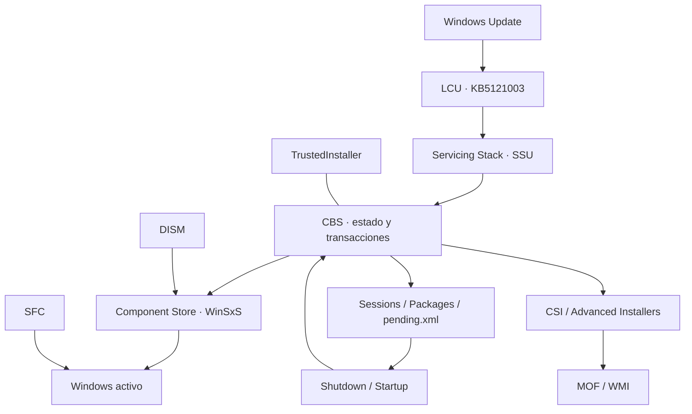
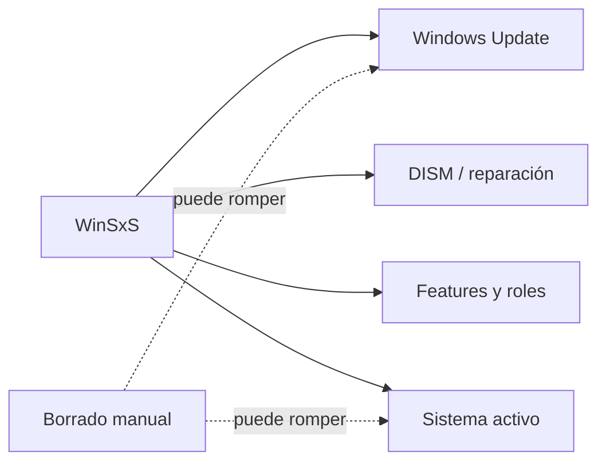
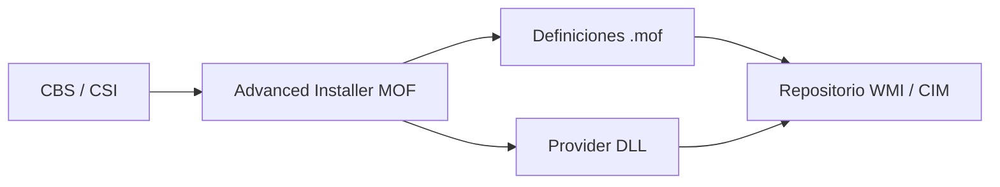
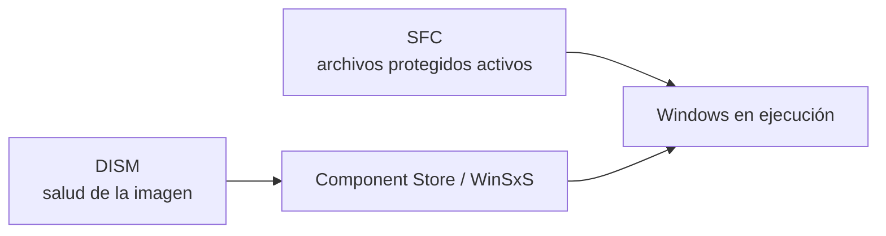
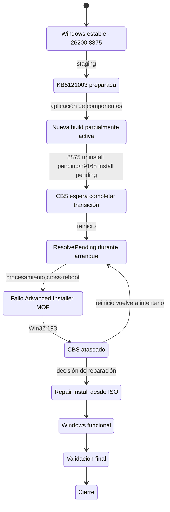
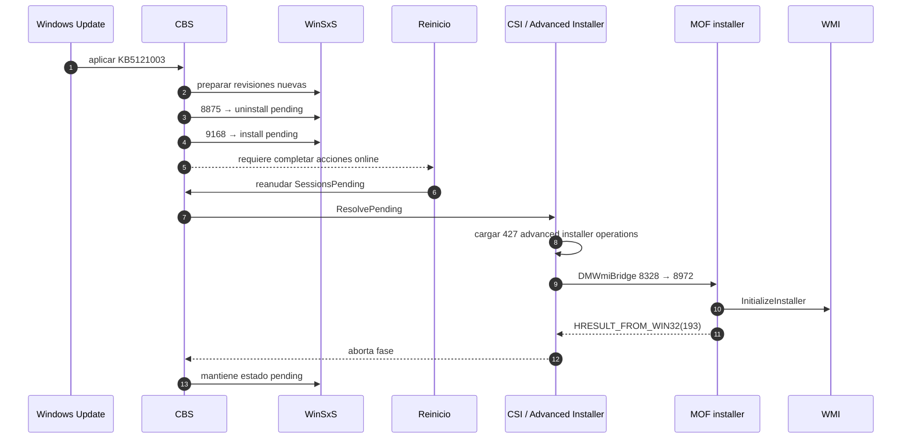
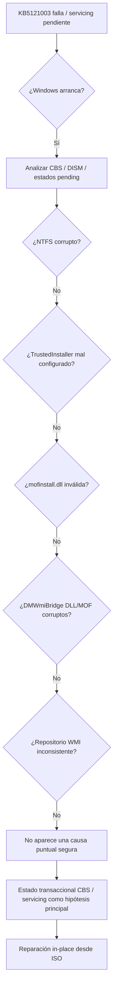
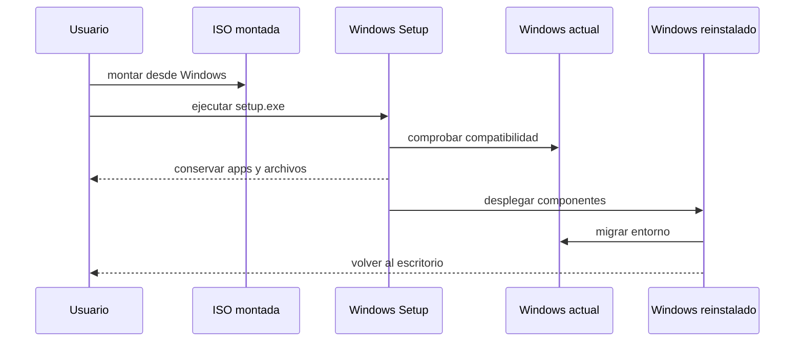
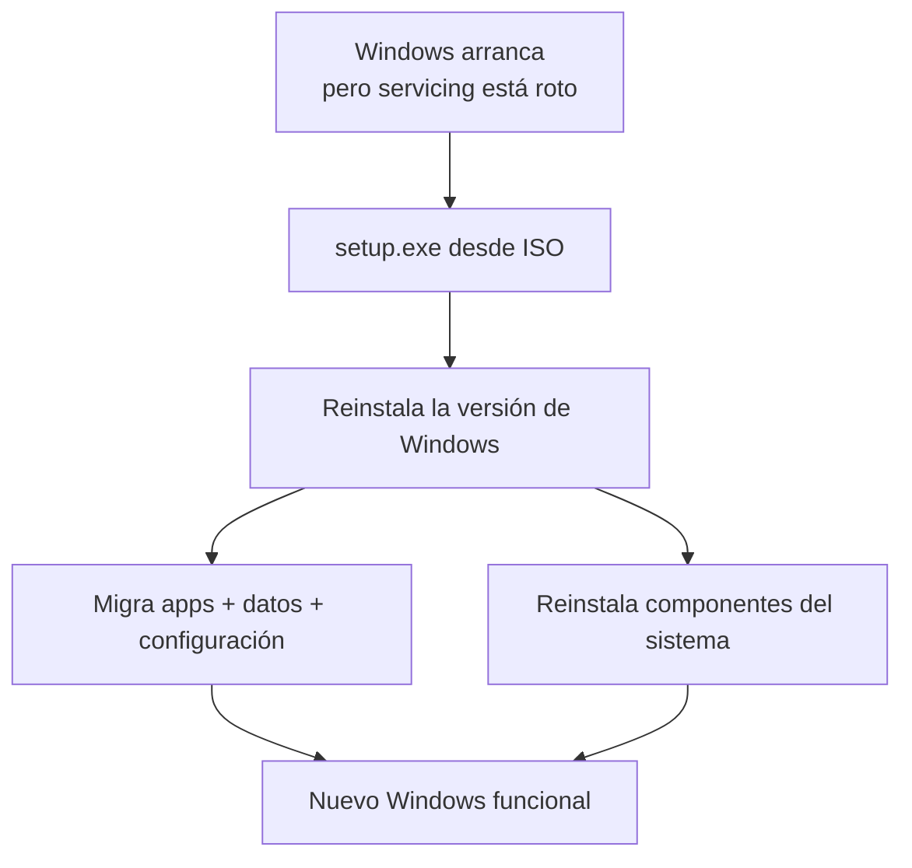
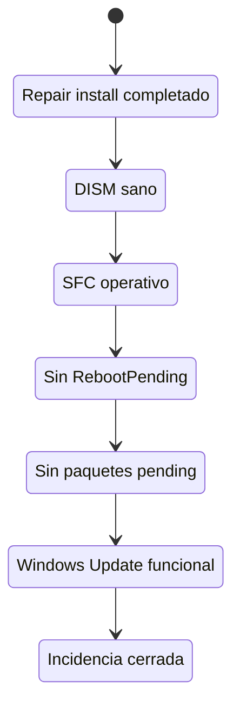

# Windows 11 25H2: anatomía de un bloqueo CBS durante KB5121003

> [!abstract] Resumen
> Windows 11 Pro 25H2 llegó a arrancar como **26200.9168**, la build correspondiente a KB5121003, pero el motor de servicing **CBS** quedó atrapado en una transacción pendiente. La revisión anterior `26100.8875` permanecía en **Desinstalación pendiente** y `26100.9168` en **Instalación pendiente**. Los reinicios no resolvían la transición y `DISM`/`SFC` quedaban bloqueados por el estado pendiente.
>
> El análisis de `CBS.log` localizó el fallo durante un **Advanced Installer MOF** para `Microsoft-Windows-MDM-WMIV2-DMWmiBridge`, con `HRESULT_FROM_WIN32(193)`. Tras descartar NTFS, WMI y corrupción evidente de los binarios implicados, se resolvió mediante **reparación in-place de Windows 11 desde ISO**, conservando aplicaciones, datos y configuración.

Esta nota reúne el incidente, la arquitectura que permite entenderlo y el
procedimiento que lo resolvió. La intención no es dejar otra receta de “ejecuta
DISM y reinicia”, sino construir un mapa reutilizable: qué componente entrega la
actualización, quién mantiene el estado transaccional, por qué una build puede
estar activa y pendiente a la vez, y cuándo una reparación in-place resulta más
segura que tocar WinSxS a mano.

---

## El mapa del servicing antes de entrar en el caso

Windows Update es la parte visible, pero no instala por sí solo cada componente.
La actualización acumulativa (**LCU**) llega acompañada por la infraestructura de
mantenimiento (**Servicing Stack / SSU**). Dentro de esa ruta, **Component Based
Servicing (CBS)** resuelve paquetes, revisiones, dependencias y operaciones que
pueden cruzar un reinicio. `TrustedInstaller` proporciona el servicio de confianza
para modificar componentes protegidos, y **WinSxS** conserva el almacén desde el
que Windows mantiene el sistema.



La versión corta es esta:

> Windows Update entrega; la servicing stack y CBS aplican; WinSxS conserva los
> componentes; DISM observa la imagen; SFC comprueba archivos protegidos activos.

### WinSxS no es una carpeta de copias sobrantes

`C:\Windows\WinSxS` es el **Windows Component Store**. Mantiene manifiestos,
payloads y revisiones que permiten actualizar, activar características y reparar
Windows. Parte de lo que parece duplicado se referencia mediante hard links.



Por eso inspeccionar `pending.xml` o una revisión no autoriza a borrarla. Quitar
el indicador de una transacción no repara la operación que representa.

### DISM y SFC miran capas relacionadas, no idénticas

`sfc /scannow` comprueba archivos protegidos del Windows activo. DISM puede
analizar y reparar la imagen y su component store:

```cmd
DISM /Online /Cleanup-Image /CheckHealth
DISM /Online /Cleanup-Image /ScanHealth
DISM /Online /Cleanup-Image /RestoreHealth
```

Así se explica un resultado que parece contradictorio: SFC puede ver correctos
los archivos en uso mientras DISM detecta que la fuente con la que Windows los
mantiene está dañada o atrapada en una transacción.

### Qué significa `pending`

Una LCU puede preparar la revisión nueva, marcar la anterior para retirada y
dejar acciones que solo son seguras durante shutdown/startup. El estado pendiente
es normal mientras la transición progresa; se vuelve sospechoso cuando sobrevive
a varios reinicios, bloquea DISM/SFC y CBS repite el mismo punto de fallo.


Los rastros más útiles son `RebootPending`, `SessionsPending`, el estado de los
paquetes y `C:\Windows\WinSxS\pending.xml`. Ninguno basta por separado; juntos
permiten reconstruir la transición.

### Advanced Installers: actualizar no siempre es copiar archivos

Algunos componentes necesitan registrar clases, proveedores u otros estados.
CBS/CSI puede invocar **advanced installers** especializados. Un instalador MOF,
por ejemplo, conecta definiciones `.mof` y DLL de proveedor con WMI:



Esta capa explica por qué una actualización acumulativa podía atascarse al
procesar `DMWmiBridge`: la descarga ya había terminado; el fallo ocurría mucho
más abajo, durante la transición de un componente concreto.

---

## 1. El síntoma que parecía un fallo de Windows Update

La incidencia comenzó con varios fallos al instalar la actualización acumulativa de agosto de 2026:

- **KB5121003**
- Windows 11 25H2 / 24H2
- build objetivo de Windows 11 25H2: **26200.9168**
- SSU integrada: **KB5123304 / 26100.9156**

Windows Update mostraba inicialmente:

```text
0x80070570
ERROR_FILE_OR_DIRECTORY_CORRUPTED
```

El primer impulso razonable era sospechar de:

- una descarga corrupta;
- la caché de Windows Update;
- el almacén de componentes;
- o incluso el sistema de archivos.

Sin embargo, otras actualizaciones —como .NET y PowerShell— sí se habían instalado. Esto ya sugería que el problema **no era un fallo global del cliente de Windows Update**, sino algo más específico del camino de servicing de la LCU.

> [!info] Ampliar
> Microsoft describe KB5121003 como la actualización del 11 de agosto de 2026 para Windows 11 25H2/24H2 y especifica que incluye la SSU `26100.9156`.
>
> https://support.microsoft.com/es-ES/servicing/os/windows-11/2026/08/kb5121003-windows-11-24h2-25h2-security-update

---

## 2. Primera sorpresa: SFC parecía sano, DISM no

Se ejecutó:

```cmd
sfc /verifyonly
```

Resultado:

```text
Protección de recursos de Windows no encontró ninguna infracción de integridad.
```

Sin embargo:

```cmd
DISM /Online /Cleanup-Image /CheckHealth
DISM /Online /Cleanup-Image /ScanHealth
```

indicaban que el **almacén de componentes podía repararse**.

Esto no era una contradicción.



**SFC** puede no encontrar problemas en los archivos activos y, al mismo tiempo, **DISM** detectar que el almacén desde el que Windows mantiene y repara esos componentes no está sano.

> [!tip] Modelo mental
> **SFC** mira principalmente “lo que Windows está usando”.
>
> **DISM** puede mirar “la fuente y el estado de los componentes con los que Windows se mantiene”.

Fuentes ampliatorias:

- https://support.microsoft.com/en-US/Windows/Experience/Backup-Recovery/use-the-system-file-checker-tool-to-repair-missing-or-corrupted-system-files
- https://learn.microsoft.com/en-us/windows-hardware/manufacture/desktop/repair-a-windows-image?view=windows-11

---

## 3. Reset de caché: útil para descartar, insuficiente para resolver

Se limpió la caché de descargas de Windows Update:

```cmd
net stop wuauserv
net stop bits
rd /s /q "%windir%\SoftwareDistribution\Download"
net start bits
net start wuauserv
```

Después:

```cmd
DISM /Online /Cleanup-Image /RestoreHealth
```

falló con:

```text
Error: 3017
Se requiere un reinicio de sistema para revertir los cambios realizados.
```

En `DISM.log` aparecía:

```text
0x80070BC9
ERROR_FAIL_REBOOT_REQUIRED
Failed finalizing changes
Failed processing package changes
```

La incidencia había dejado de parecer un simple problema de descarga. El bloqueo estaba ya **dentro del servicing**.

---

## 4. El sistema ya era 26200.9168, pero la actualización no había terminado

Tras reiniciar:

```text
winver
Windows 11 Pro 25H2
26200.9168
```

Esto fue una de las partes más interesantes del caso.

La build visible era ya la nueva, pero la transacción CBS seguía abierta.

### Estado real de los paquetes

Al filtrar correctamente la salida localizada de DISM:

```cmd
DISM /Online /Get-Packages /Format:Table | findstr /i "pendiente"
```

aparecían numerosos pares:

```text
26100.8875  → Desinstalación pendiente
26100.9168  → Instalación pendiente
```

y, de forma especialmente significativa:

```text
Package_for_RollupFix ... 26100.8875.1.28
→ Desinstalación pendiente

Package_for_RollupFix ... 26100.9168.1.19
→ Instalación pendiente
```

### Lo que estaba ocurriendo



> [!important] Lección
> **“La build ya cambió” no equivale necesariamente a “el servicing terminó correctamente”.**
>
> Una parte de la actualización puede estar suficientemente aplicada para que el sistema arranque con la nueva build y, sin embargo, quedar operaciones que CBS debe confirmar o ejecutar durante el reinicio.

---

## 5. Las huellas de una transacción CBS pendiente

Se encontraron varias señales que, vistas en conjunto, apuntaban a una única explicación.

### `RebootPending`

```cmd
reg query "HKLM\SOFTWARE\Microsoft\Windows\CurrentVersion\Component Based Servicing\RebootPending"
```

La clave existía.

En cambio:

```cmd
reg query "HKLM\SOFTWARE\Microsoft\Windows\CurrentVersion\WindowsUpdate\Auto Update\RebootRequired"
```

no existía.

Es decir:

| Indicador                       | Estado |
| ------------------------------- | ------ |
| Windows Update `RebootRequired` | No     |
| CBS `RebootPending`             | Sí     |

El cliente de Windows Update ya no era quien pedía el reinicio: **CBS** lo hacía.

### `pending.xml`

```cmd
dir C:\Windows\WinSxS\pending.xml
```

Resultado:

```text
25/08/2026  12:41
50.022.031 bytes
pending.xml
```

El archivo tenía aproximadamente **47,7 MiB**.

### `SessionsPending`

```cmd
reg query "HKLM\SOFTWARE\Microsoft\Windows\CurrentVersion\Component Based Servicing\SessionsPending" /s
```

La sesión mostraba esta secuencia:

```text
1_Queued          12:34:14
1_Started         12:34:14
1_Planned         12:39:49
1_Resolved        12:39:49
1_Staged          12:39:49
1_Installed       12:41:46
1_Pended          12:42:11

1_ShutdownStart   15:35:41
1_ShutdownFinish  15:35:41
1_Startup         15:37:03
```

La actualización había llegado a **Installed**, había pasado a **Pended**, y el reinicio sí había activado el procesamiento de startup. Pero la sesión no llegaba al final.

### `PendingFileRenameOperations`

No existía.

Esto reducía la posibilidad de que el problema fuera simplemente una cola genérica de sustitución de archivos de Session Manager.

---

## 6. CBS.log: la pieza que convirtió el diagnóstico en evidencia

El log decisivo fue:

```text
C:\Windows\Logs\CBS\CBS.log
```

Durante el shutdown:

```text
15:35:41
current ExecuteState is CbsExecuteStateResolvePending
```

Durante el siguiente arranque:

```text
15:37:03
Startup: current ExecuteState is CbsExecuteStateResolvePending
```

Poco después:

```text
15:37:11
loaded 427 pending advanced installer operations
```

Es decir: **Windows sí estaba intentando consumir la transacción pendiente**.

### La operación en la que se rompe

A las `15:37:16`:

```text
Begin executing advanced installer
Old component:
Microsoft-Windows-MDM-WMIV2-DMWmiBridge
10.0.26100.8328 amd64

New component:
Microsoft-Windows-MDM-WMIV2-DMWmiBridge
10.0.26100.8972 amd64

Install mode: delta
Installer name: 'Mof'
```

CBS carga después:

```text
...\10.0.26100.9156...\mofinstall.dll
```

y falla:

```text
HRESULT_FROM_WIN32(193)

Windows::COM::ExecutionHandler::InitializeSmartInstaller
m_SmartInstaller->InitializeInstaller(InstallerServices)
```

El procesamiento de startup termina con:

```text
Startup processing completed. [HRESULT = 0x80010105]
Failed during startup processing
```

y la interfaz mostraba aproximadamente el **36 %** cuando abortaba.

### Secuencia observada



> [!note] Qué es CSI
> En los logs de servicing aparece **CSI** (_Component Servicing Infrastructure_) como parte de la infraestructura interna que ejecuta operaciones sobre componentes. Para uso práctico de diagnóstico, conviene verlo como una capa interna del servicing que trabaja bajo el paraguas de CBS/Component Store.

---

## 7. El error 193: una pista, no una sentencia

Win32 `193` corresponde a:

```text
ERROR_BAD_EXE_FORMAT
```

La tentación inicial era concluir que `mofinstall.dll` estaba corrupta.

Pero el log solo demostraba que el error aparecía **durante la inicialización de esa ruta**, no que la propia DLL fuera necesariamente el archivo defectuoso.

Se investigó antes de modificar nada.

---

## 8. Descartes: convertir hipótesis en evidencia

### 8.1 TrustedInstaller

```cmd
sc query TrustedInstaller
sc qc TrustedInstaller
```

Resultado:

```text
STATE       : RUNNING
START_TYPE  : AUTO_START
```

Registro:

```text
Start = 0x2
```

Se descartó el escenario de TrustedInstaller deshabilitado o forzado a manual.

### 8.2 Sistema de archivos

```cmd
chkdsk C: /scan
```

Resultado:

```text
Se examinó el sistema de archivos sin encontrar problemas.
No se requieren más acciones.
0 KB en sectores defectuosos.
```

El escaneo recorrió millones de registros y no encontró corrupción NTFS.

### 8.3 `mofinstall.dll`

Archivo:

```text
...\amd64_microsoft-windows-s..ck-mof-onecoreadmin_...
\10.0.26100.9156...\mofinstall.dll
```

Comprobación:

```text
Length      : 128496
FileVersion : 10.0.26100.9156
MZ          : 4D5A
PE          : válido
Machine     : 0x8664
Signature   : Valid
SHA256      : DCF764DF5AB397DBB42E3A85D3EF8D2E6B1961673CDF14C760F785BF4E2B2A5D
```

No había evidencia de que fuera un PE incorrecto, de arquitectura errónea o con firma alterada.

### 8.4 DMWmiBridge

Existían las revisiones:

```text
10.0.26100.1591
10.0.26100.8328
10.0.26100.8972
```

Los componentes contenían los archivos esperados:

```text
DMWmiBridgeProv.dll
DMWmiBridgeProv1.dll
DMWmiBridgeProv.mof
DMWmiBridgeProv1.mof
DMWmiBridgeProv_Uninstall.mof
DMWmiBridgeProv1_Uninstall.mof
```

Los DLL relevantes eran:

- PE AMD64 (`0x8664`);
- de tamaño coherente;
- con firma `Valid`.

### 8.5 Sintaxis de los MOF

```cmd
mofcomp -check "...DMWmiBridgeProv.mof"
mofcomp -check "...DMWmiBridgeProv1.mof"
mofcomp -check "...DMWmiBridgeProv_Uninstall.mof"
mofcomp -check "...DMWmiBridgeProv1_Uninstall.mof"
```

Todos se analizaron correctamente.

Los avisos sobre `#PRAGMA AUTORECOVER` en los MOF de desinstalación eran **advertencias**, no fallos sintácticos.

Microsoft documenta que `mofcomp -check` analiza el MOF **sin conectarse al servidor WMI ni modificar el repositorio**:

https://learn.microsoft.com/en-us/windows/win32/wmisdk/mofcomp

### 8.6 Repositorio WMI

```cmd
winmgmt /verifyrepository
```

Resultado:

```text
El repositorio de WMI es coherente.
```

Por ello **no** se ejecutaron:

```cmd
winmgmt /salvagerepository
winmgmt /resetrepository
```

---

## 9. Árbol de diagnóstico



La investigación no “demostró” que CBS por sí solo fuese el componente defectuoso. Lo que sí demostró fue algo operacionalmente más útil:

> **El sistema estaba atrapado en una transacción CBS reproduciblemente pendiente y no apareció una pieza concreta que pudiera repararse manualmente con seguridad.**

---

## 10. Por qué NO se borró `pending.xml`

Era técnicamente posible encontrar en Internet recetas que proponen:

- borrar o renombrar `pending.xml`;
- eliminar `RebootPending`;
- borrar `PackagesPending`;
- reemplazar archivos directamente en WinSxS;
- forzar acciones de reversión.

No se hizo.

### Motivo

Esos elementos no eran basura: eran **la representación de una transacción real que CBS estaba intentando resolver**.

Eliminar el indicador no equivale a arreglar la operación que representa.


Microsoft advierte explícitamente contra la eliminación manual de archivos de WinSxS porque puede dejar Windows sin capacidad de arrancar o actualizar:

https://learn.microsoft.com/es-es/windows-hardware/manufacture/desktop/determine-the-actual-size-of-the-winsxs-folder?view=windows-11

---

## 11. Cambio de estrategia: reparar Windows, no perseguir una DLL

A estas alturas se había descartado razonablemente:

- NTFS;
- TrustedInstaller;
- el PE y firma de `mofinstall.dll`;
- los DLL principales del componente;
- la sintaxis MOF;
- el repositorio WMI.

Mientras tanto:

- `RebootPending` persistía;
- `pending.xml` persistía;
- los paquetes seguían pendientes;
- DISM chocaba con `3017 / 0x80070BC9`;
- SFC informaba de una reparación pendiente;
- Settings / Windows Update se cerraban o no cargaban correctamente.

La relación riesgo/beneficio cambió.

Seguir profundizando en dependencias internas de CSI/MOF podía producir más información, pero ya no parecía ofrecer una **reparación segura y soportada**.

Se eligió entonces:

> **reinstalación/reparación in-place de Windows 11 desde ISO, conservando aplicaciones, datos y configuración.**

---

## 12. Reparación aplicada

Datos del sistema:

```text
Edición: Professional
Versión: 25H2
Build: 26200.9168
UI predeterminada: es-ES
Arquitectura: x64
```

Una reparación in-place no es lo mismo que “Restablecer este PC” ni que arrancar
desde un USB para instalar desde cero:

| Operación                      |        Aplicaciones |               Datos | Configuración |
| ------------------------------ | ------------------: | ------------------: | ------------: |
| DISM / SFC                     |            conserva |            conserva |      conserva |
| Repair install con «conservar» |            conserva |            conserva |      conserva |
| Reset manteniendo archivos     | normalmente elimina | conserva personales |       parcial |
| Instalación limpia             |             elimina |             elimina |       elimina |

Antes de empezar se comprobó que el medio coincidía en **edición, arquitectura,
versión e idioma de interfaz**. Estas consultas ayudan a no descubrir una
incompatibilidad cuando Setup ya está abierto:

```cmd
DISM /Online /Get-CurrentEdition
DISM /Online /Get-Intl
reg query "HKLM\SOFTWARE\Microsoft\Windows NT\CurrentVersion" /v DisplayVersion
reg query "HKLM\SOFTWARE\Microsoft\Windows NT\CurrentVersion" /v CurrentBuildNumber
```

La lista mínima antes de una intervención así fue:

- copia externa de los datos importantes;
- espacio libre suficiente y alimentación conectada;
- edición, idioma y arquitectura compatibles;
- aplicaciones cerradas y periféricos no esenciales desconectados;
- ninguna manipulación manual previa de WinSxS o de los estados pending.

Se utilizó una ISO compatible de Windows 11 y se montó **desde el Windows que
seguía arrancando**. Este detalle es decisivo: ejecutar `setup.exe` dentro de la
instalación permite a Setup evaluar y migrar aplicaciones, datos y configuración.
Arrancar el equipo desde el medio conduce a otra ruta de instalación.

La ISO se montó desde el Windows existente y se inició:

```cmd
D:\setup.exe /DynamicUpdate Disable
```

> [!warning]
> El proceso se inició **desde Windows**, no arrancando el equipo desde el medio.
>
> La opción crítica era **Conservar archivos personales y aplicaciones**.

Si esa opción no aparece, hay que detenerse. Puede indicar un idioma, edición o
medio incompatibles, o un bloqueo de migración que todavía no se ha entendido.

`/DynamicUpdate Disable` impidió que Setup realizara operaciones de Dynamic Update durante la reinstalación.

Microsoft documenta ese parámetro aquí:

https://learn.microsoft.com/es-es/windows-hardware/manufacture/desktop/windows-setup-command-line-options?view=windows-11

La reinstalación terminó correctamente y la máquina volvió a funcionar con
normalidad. En este caso se desactivó Dynamic Update porque la ruta que estaba
fallando era precisamente Windows Update/CBS; no es una regla universal para
todas las reparaciones.



---

## 13. Qué hace conceptualmente una reparación in-place

No es un `Reset this PC` ni una instalación limpia.



Microsoft describe la instalación in-place con medio como una reinstalación que puede conservar:

- datos personales;
- aplicaciones;
- configuración.

https://support.microsoft.com/en-us/windows/reinstall-windows-with-the-installation-media-d8369486-3e33-7d9c-dccc-859e2b022fc7

> [!note] Interpretación del caso
> No es necesario afirmar que Setup “reconstruyó CBS” de una forma concreta. Lo que sí podemos afirmar es que **reinstaló Windows y sus componentes manteniendo el entorno del usuario**, y el equipo volvió a un estado funcional. La validación posterior debe confirmar si el servicing quedó también limpio.

---

## 14. Estado final y validación pendiente

La máquina funciona correctamente tras la reparación.

Para cerrar técnicamente el caso deben ejecutarse:

```cmd
DISM /Online /Cleanup-Image /ScanHealth

sfc /scannow

reg query "HKLM\SOFTWARE\Microsoft\Windows\CurrentVersion\Component Based Servicing\RebootPending"

DISM /Online /Get-Packages /Format:Table | findstr /i "pendiente"
```

### Resultado esperado



Hasta obtener estas comprobaciones, el estado de la entrada queda como:

```yaml
status: resuelto-provisionalmente
```

---

## 15. Lecciones aprendidas

### 1. Build activa y servicing no son lo mismo

`winver` puede mostrar la nueva build aunque CBS conserve operaciones pendientes.

### 2. SFC limpio no descarta un problema del component store

SFC y DISM trabajan sobre capas relacionadas pero no idénticas.

### 3. Los estados pending deben leerse en conjunto

`RebootPending`, `SessionsPending`, `PackagesPending` y `pending.xml` construyen una imagen mucho más precisa que cualquiera de ellos por separado.

### 4. Los logs cambian el tipo de diagnóstico

Sin `CBS.log`, el caso era “Windows Update falla”.

Con `CBS.log`, pasó a ser:

> “CBS intenta `ResolvePending`, carga 427 advanced installer operations y falla al inicializar un Advanced Installer MOF concreto”.

### 5. Una pista no es una causa

`ERROR_BAD_EXE_FORMAT` junto a `mofinstall.dll` no autorizaba a reemplazar esa DLL. Las pruebas demostraron que el binario era estructuralmente válido y estaba firmado.

### 6. Saber cuándo dejar de profundizar también forma parte del diagnóstico

Cuando las rutas manuales empiezan a exigir manipular transacciones de servicing internas, una reparación in-place puede ser más segura que una “cirugía” sobre WinSxS.

---

## 16. Evidencias principales del caso

| Evidencia                      | Resultado                                  |
| ------------------------------ | ------------------------------------------ |
| Windows                        | 11 Pro 25H2                                |
| Build visible                  | `26200.9168`                               |
| KB                             | `KB5121003`                                |
| SSU incluida                   | `26100.9156`                               |
| Error Windows Update inicial   | `0x80070570`                               |
| Error servicing posterior      | `3017 / 0x80070BC9`                        |
| `CBS\RebootPending`            | presente                                   |
| `WindowsUpdate\RebootRequired` | ausente                                    |
| `pending.xml`                  | 50.022.031 bytes                           |
| Rollup `8875`                  | Desinstalación pendiente                   |
| Rollup `9168`                  | Instalación pendiente                      |
| Advanced installers pendientes | 427                                        |
| Punto de fallo                 | DMWmiBridge `8328 → 8972`, installer `Mof` |
| Error CSI                      | `HRESULT_FROM_WIN32(193)`                  |
| TrustedInstaller               | RUNNING / AUTO_START                       |
| `chkdsk C: /scan`              | limpio, 0 KB bad sectors                   |
| `mofinstall.dll`               | PE AMD64, firma válida                     |
| MOF DMWmiBridge                | sintaxis válida                            |
| repositorio WMI                | coherente                                  |
| Resolución aplicada            | reparación in-place desde ISO              |

---

## 17. Fuentes oficiales ampliatorias

### Caso / actualización

- [**KB5121003 — 11 de agosto de 2026**](https://support.microsoft.com/es-ES/servicing/os/windows-11/2026/08/kb5121003-windows-11-24h2-25h2-security-update)

### Servicing / CBS / SSU

- [**Actualizaciones de pila de mantenimiento**](https://learn.microsoft.com/es-es/windows/deployment/update/servicing-stack-updates)

### WinSxS / Component Store

- [**Administrar el almacén de componentes**](https://learn.microsoft.com/es-es/windows-hardware/manufacture/desktop/manage-the-component-store?view=windows-11)
- [**Advertencias y tamaño real de WinSxS**](https://learn.microsoft.com/es-es/windows-hardware/manufacture/desktop/determine-the-actual-size-of-the-winsxs-folder?view=windows-11)

### DISM / SFC

- [**Repair a Windows Image**](https://learn.microsoft.com/en-us/windows-hardware/manufacture/desktop/repair-a-windows-image?view=windows-11)
- [**System File Checker + DISM**](https://support.microsoft.com/en-US/Windows/Experience/Backup-Recovery/use-the-system-file-checker-tool-to-repair-missing-or-corrupted-system-files)

### WMI / MOF

- [**mofcomp**](https://learn.microsoft.com/en-us/windows/win32/wmisdk/mofcomp)

### Reparación in-place

- [**Reinstall Windows with the installation media**](https://support.microsoft.com/en-us/windows/reinstall-windows-with-the-installation-media-d8369486-3e33-7d9c-dccc-859e2b022fc7)
- [**Windows Setup command-line options**](https://learn.microsoft.com/es-es/windows-hardware/manufacture/desktop/windows-setup-command-line-options?view=windows-11)

---

## Relacionado

- [[arch-wsl2-e-unexpected-recuperacion|Arch Linux en WSL2: recuperar el sistema desde otra capa]]
- [[01-vostro5581-w11-iss-tecnico-forense|Dell Vostro 5581: aislar un fallo mediante pruebas comparativas]]
