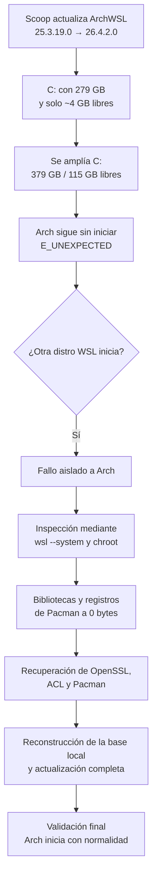

# Arch Linux en WSL: recuperación de un `E_UNEXPECTED`

> [!summary]
> Arch Linux deja de iniciar en WSL y devuelve `Wsl/Service/E_UNEXPECTED`.
>
> El análisis descarta un fallo general de WSL y localiza el problema dentro de la distribución: varias bibliotecas críticas y registros de Pacman aparecen truncados a cero bytes.
>
> La recuperación se completa sin desregistrar la distribución, sin reinstalar Arch y conservando el VHDX original.

## Workflow resumido



## 1. Contexto

El incidente se produce en una instalación Arch Linux sobre WSL2, gestionada mediante ArchWSL y Scoop.

Datos relevantes:

| Elemento     | Valor                                                  |
| ------------ | ------------------------------------------------------ |
| Windows      | Windows 11, build `10.0.26200.8875`                    |
| WSL          | `2.7.11.0`                                             |
| ArchWSL      | `25.3.19.0` → `26.4.2.0`                               |
| VHDX         | `96,63 GiB` físicos, `1 TiB` virtual                   |
| Ubicación    | `C:\Applications\Scoop\persist\archwsl\data\ext4.vhdx` |
| `C:` antes   | `279 GB`, aproximadamente `4 GB` libres                |
| `C:` después | `379 GB`, `115 GB` libres                              |

La actualización de ArchWSL mediante Scoop constituye el último cambio visible antes del fallo.

La partición `C:` presenta inicialmente solo un `1,4 %` de espacio libre. Se amplía hasta disponer de aproximadamente un `30,3 %`, pero Arch continúa sin iniciar.

> [!important]
> La falta de espacio constituye un factor contribuyente plausible, aunque no queda demostrada como causa directa.

## 2. Aislamiento del problema

Arch figura registrada, pero no inicia ni siquiera como `root` con una shell mínima.

En cambio, `docker-desktop` sí arranca dentro de WSL.

Esto permite descartar:

- Un fallo general de WSL.
- Un problema global del kernel.
- Un error de Hyper-V.
- La configuración del usuario o de la shell.

El problema queda aislado a la distribución Arch y a su sistema de archivos.

## 3. Diagnóstico

La raíz de Arch se inspecciona mediante `wsl --system` y `chroot`.

El VHDX existe, se puede montar y `ext4` no presenta daños graves.

El error real aparece al intentar ejecutar `systemd` y `pacman`:

```console
libcrypto.so.3: file too short
```

Se detectan varias bibliotecas críticas a cero bytes:

```console
libcrypto.so.3
libssl.so.3
libacl.so.1
```

También se encuentran entradas dañadas en:

```console
/var/lib/pacman/local
```

Pacman conserva los paquetes como instalados, pero pierde parte de la información sobre sus archivos y propietarios.

## 4. Recuperación

La recuperación se realiza por capas:

1. Restauración de OpenSSL desde la caché local de Pacman.
2. Uso de `pacman-static` para recuperar `acl` y volver a ejecutar Pacman.
3. Arranque de Arch como `root`.
4. Reconstrucción de las entradas dañadas de Pacman.
5. Reinstalación de paquetes afectados, entre ellos Bash, Ansible y Ansible Core.
6. Ejecución completa de `pacman -Syu`.
7. Eliminación de restos huérfanos de versiones antiguas.

La operación se apoya siempre en:

- Una copia previa del VHDX.
- La caché local de paquetes.
- Reparaciones limitadas a paquetes concretos.
- Validaciones posteriores con `pacman -Qkk`.

## 5. Resultado

Arch vuelve a iniciar normalmente mediante:

```powershell
wsl -d Arch
```

Se conservan:

- La distribución original.
- Los datos del usuario.
- El VHDX.
- La configuración de WSL.
- El entorno Arch existente.

No resulta necesario:

- Ejecutar `wsl --unregister`.
- Reinstalar ArchWSL.
- Crear una distribución nueva.
- Restaurar el VHDX completo.

## Causa técnica

La causa técnica confirmada corresponde a:

```console
bibliotecas críticas truncadas
        +
base local de Pacman parcialmente dañada
        ↓
systemd no puede iniciar
        ↓
WSL devuelve E_UNEXPECTED
```

La causa desencadenante exacta no queda demostrada.

Las dos condiciones relevantes son:

- Una actualización reciente de ArchWSL mediante Scoop.
- Una partición `C:` con solo unos `4 GB` libres antes del redimensionado.

Ninguna de las dos se presenta como causa definitiva sin evidencia adicional.

## Aprendizajes

- `E_UNEXPECTED` puede ocultar un error Linux interno.
- Una segunda distribución WSL permite separar host y distribución.
- `wsl --system` y `chroot` resultan decisivos para obtener el error real.
- La caché de Pacman puede salvar una instalación dañada.
- `/var/lib/pacman/local` forma parte del estado crítico del sistema.
- Un archivo de cero bytes no siempre está corrupto; depende de su función.
- No debe desregistrarse una distribución antes de agotar las opciones de recuperación.
- El espacio libre del host debe comprobarse antes de actualizaciones importantes.

## Detalle técnico

Los comandos, validaciones y pasos reproducibles se documentan en:

[[arch-wsl2-e-unexpected-recuperacion|Write-Up técnico: recuperación de Arch Linux en WSL]]
